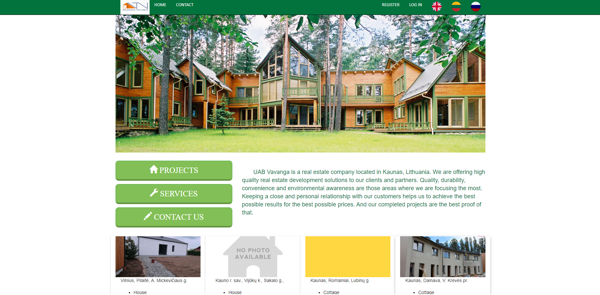
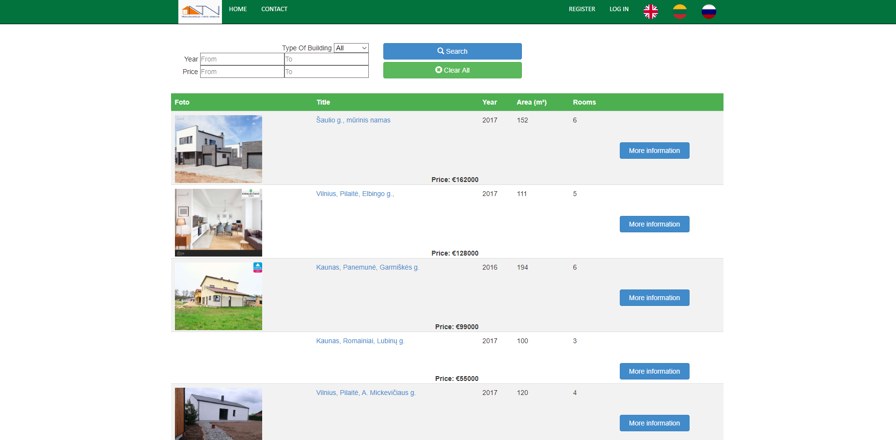
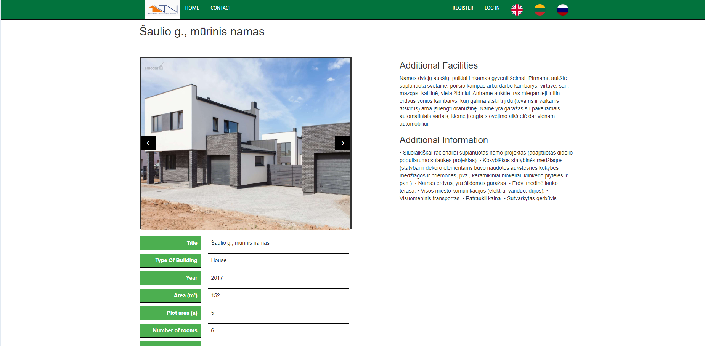

# Real Estate 

Web application created for an imaginary real estate company in Lithuania. Website is providing visitors
an ability to search for available to buy real estate projects, read information about them and contact
the company via special form online.

The application is build on .NET platform using ASP.NET MVC 5 framework. In this project the Model-View-Controller
architectural design pattern is used together with an internal based SQL database.

User has an ability to choose between three different languages: English, Lithuanian and Russian. With the help
of `cookies`the application remembers which language was used during the last visit of the user.
 

## Technologies used

+ .Net
+ C#
+ SQL
+ ASP.NET MVC 5
+ HTML
+ CSS
+ Bootstrap

## Getting Started

In order to run the project a small amount of prerequisites and additional steps have to be fulfilled.

### Prerequisites

+ Visual Studio IDE installed

### Running

+ Clone the project from GitHub repository
+ Open `RealEstate.sln` file using Visual Studio IDE
+ Start application by clicking `Play` button and choosing a browser